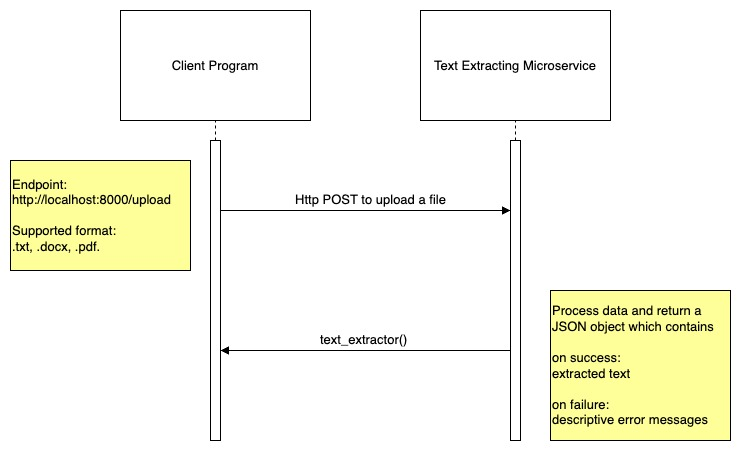

# Requesting Data
This microservice is called using http request where:  
  i. method: POST  
  ii. endpoint: http://localhost:8000/upload  
  iii. Content-Type: multipart/form-data (usually automatically set by http client)  
  iv. body: form field named 'file', containing the binary data of the file to upload  
    
  Example call in python:  
  ```python  
  import requests
  
  url = "http://localhost:8000/upload"
  with open("example.pdf", "rb") as f:
    response = requests.post(url, files={'file': f})
        
  ```

# Receiving Data  
After uploading the file, the client receives an HTTP response from the microservice where:   
  i.Status code:  
  a. 200 if succeeded  
  b. other status codes if failed (e.g., 415 Unsupported Media Type)    
  ii. Content-Type: application/json    
  iii. Body: A JSON object containing the extracted text or error message:  
  a. on success  
  ```json  
  {
    "extracted_text": "Text extracted from the uploaded file"  
  }
  ```  
  b. on failure
  ```json  
  {
    "error": "Predefined error message."
  }
  ```

  Example call in python (following the snippet for requesting data):
  ```python  
  if response.status_code == 200:
    print("Extracted Text: ", response.json().get('extracted_text', 'No text found.'))
  else:
    print(f"Failed to upload file. Status code: {response.status_code}")
    print("Error:", response.json().get('error', 'Unknown error'))  
  ```

# UML


